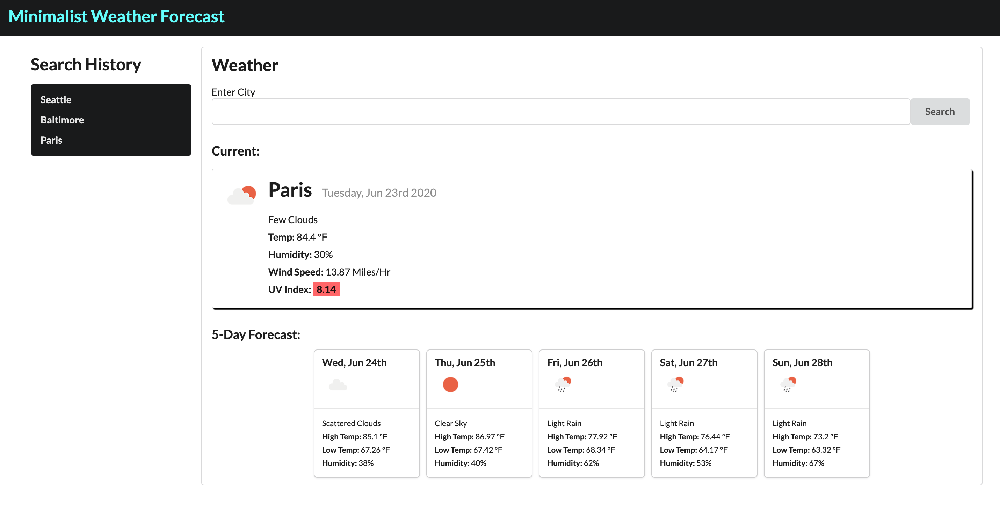

# Minimalist Weather Forecast
​
#### Created On: 06/22/2020
​
#### By Matthew Wieciech
​
## Description
Find current weather and a 5 day forecast for any city.

​
## Features
​
Input any city.  
​
Current weather for city will be displayed including temperature, humidity, wind speed, and UV index.  
​
High and low temperatures will be shown for the following 5 days.  

Keeps track of your search history locally and user can easily select an existing search to immediately display that city's current weather and 5 day forecast.
​
## Known Bugs
​
NA
​
## Support and contact details
​
matt.wieciech@gmail.com
​
## Technologies Used
​
Javascript    
Jquery  
Semantic UI  
Moment.js  
HTML5  
CSS  
​
## Contribution Guidlines 
​
Direct link to site:
https://wheaties5588.github.io/weather-tracker/
​
### License
​
Copyright(c) 2020 By Matthew Wieciech
​
This software is licensed under MIT license.
